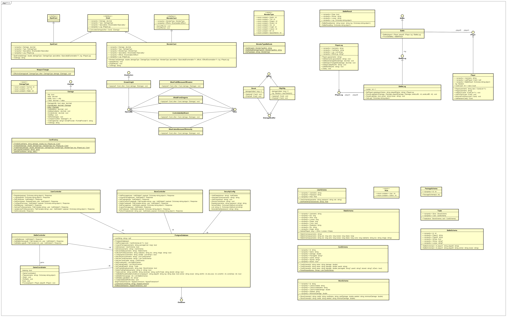

# MTCG

## :package: Requirements

PostgreSQL Database

Tested with `Postgres 12` under `WSL2`.

> Note: A connection configuration needs to be added under `MTCG/Resources/dbConfig.json` (a template can be found in the `Resources` folder). If no configuration is found, default values will be used.

## 🛠 Build 

```
dotnet build --configuration Release
```

## 🚴‍♂️Run

Run MTCG server (port defaults to `8080`)

```
dotnet run --project ./MTCG/MTCG.csproj
```

## 🧪 Test

Run unit tests

```
dotnet test
```

For the integration CURL and/or [Postman](https://www.postman.com/) is needed.

The curl-batch scripts can be found under `MTCG-Test/Integration/curl`.

The test collections for Postman can be found under `MTCG-Test/Integration/postman`.

For both cases two integration test-suites can be found, one for the basic requirements and one that tests bonus features.

> Note: After every integration test run, the database needs to be dropped:
>
> ```sql
> DROP DATABASE mtcg;
> ```


## `MTCG` Protocol

### Design



The *Monster Trading Cards Game* uses the `WebService`-library under the hood for the REST-Server and for a simple *Inversion of Control* container with *Dependency Injection*. 

With this one can annotate classes with the `[Component]` attribute, so that their are instanced by the library.  Other classes can get these managed classes through injecting them in their fields via the `[Autowired]` attribute.

Endpoints are are managed through classes marked with `[Controller]`. There one can define endpoints with methods that are marked with HTTP-method and path attributes like `[Post("/battles")]`. These methods can have parameters for payloads like `Dictionary<string, object>?` for JSON or just `string?` for plaintext. Additional path variables like  the 1 in `/foo/1` can be accessed through a `PathVariable` parameter, additional information in the format `/foo?id=1` can be accessed through a `PathParam` attribute. User information can be read from an additional `AuthDetails?` parameter.  User information is only available on secured endpoints, which are configured by a security config class annotated with `[Security]`.

The `MTCG` implementations has following managed classes:

* Controllers

  * `BattleController`

    Defines endpoints used for battles and to query battle histories.

  * `StoreController`

    Defines endpoints used for trading deals.

  * `UserController`

    Defines endpoints for most user interactions like registration, login, profile page query/update, deck configuration and more.

* Security

  * `SecurityConfig`

    Defines which endpoints should be secured and how registration and authentication is performed.

* Components

  * `PostgresDatabase`

    Used to perform CRUD operations for the `MTCG`. At the start the class checks if the needed database exists, if not the database and needed tables are automatically created. All operations involving some form of database change are performed with *transactions*. 

  * `GameCoordinator`

    Hosts the matchmaking player pool and processes the battles.

All cards, used for the battles, implement the `ICard` interface that contains a default `CalculateDamage`-method that is used in battles to determine a winner or draw in a round. Spell cards implement the `ISpellCard` interface. Monster cards on the other hand implement the `IMonsterCard` interface, which defines a new property `MonsterType` and adds support for `Effects`. `Effects` are an  additional bonus feature that allows to modify monster cards when they win a round in a battle. For example, the bonus class `Space Marine` has the effect `Boost` which permanently increases damage by 1 per won round. Effects are dropped at the end of battles or when the card is defeated in one round. `Specialites` like "*The armor of Knights is so heavy that WaterSpells make them drown them instantly*" are implemented similar to effects but are applied during the round on not after and also affect spell cards.

Cards are stored in the database only with their name [type information (Fire, Water, Regular) + card name (Spell; Ork, Dragon, ...) ] and base damage. All specialities and effects are only applied during the construction of concrete instances which is done with a simple factory (`CardFactory`). This approach makes it flexible to add new monster types (only a new enum entry is needed) and to change specialties or effects (e.g. Goblins should no longer be afraid from Dragons). 

### Lessons Learned

Describes some encountered problems.

The first implementation of the `PostgresDatabase` class that performs CRUD operations used one connection for the database for all actions. This worked mostly fine, even with transactions in use. Then after starting testing the battle logic with the CURL script I noticed to encounter a strange bug, that lead sometimes to randomly not triggering battles. I first thought it was a problem with the `ConcurrentQueue` that it sometimes failed to dequeue the player with `TryDequeue`.  But when inspecting with the debugger I noticed that this part of the code was never called, the battle never started because a player was missing! Why was a player sometimes missing, well when a player joins matchmaking the `GameCoordinator` checks if the player has a valid deck (4 cards) which is queried from `PostgresDatabase`. I debugged the deck query method and found the culprit, because only one connection was used to the database, only one `DataReader` at a time could be in use, using another one would result in a Exception (already in use). When two players simultaneously join matchmaking and decks are queried, there is a high change that one of the queries fails, because two `DataReaders` cannot co-exist on one connection which results that the failed query returns a deck of zero cards, which means that the `GameCoordinator` blocks the player from battling. The fix was to use new connections for every operation, since then I could not replicate similar problems in parallel querying.

A smaller problem was a design choice from the `WebService`-library. In the security config one can secure an endpoint through adding its path to a list. When the path is in the list, all endpoints, even with different HTTP-methods (GET, POST, ...) are secured. This was never a problem until I noticed that the querying user data (`GET /users`) and editing them (`PUT /users`) should be secured while registration (`POST /users)` should not. The fix was to convert the security API to use a dictionary with methods as keys and paths as values instead one list of path for everything.

### Unit test design

Like requirements document


### Time spent

Estimated time spent on the `MTCG`: ~ 35 - 40 h

Estimated time spent on the `WebService`: ~ 25 - 30 h

### Link to git

https://github.com/kurbaniec/SWE1-MTCG

### Used collections

Mainly used collections:


