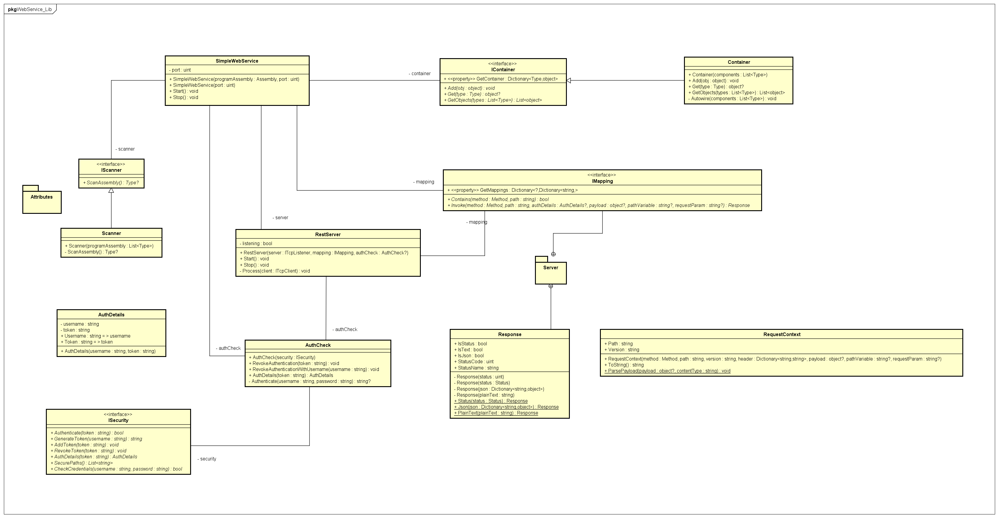

<div  align="center">
  <h1>
      WebServiceLib
  </h1>
   <p>
       Simple REST Web Service library with inversion of control.
   </p>
</div>


## 📚 About

`WebServiceLib` makes it easy to create a REST server with the help of a simple *Inversion of Control* container with *Dependency Injection*. 

With `WebServiceLib` one can annotate classes with the `[Component]` attribute, so that their are instanced by the library.  Other classes can get these managed classes through injecting them in their fields via the `[Autowired]` attribute.

Endpoints are are managed through classes marked with `[Controller]`. There one can define endpoints with methods that are marked with HTTP-method and path attributes like `[Post("/battles")]`. These methods can have parameters for payloads like `Dictionary<string, object>?` for JSON or just `string?` for plaintext. Additional path variables like  the 1 in `/foo/1` can be accessed through a `PathVariable` parameter, additional information in the format `/foo?id=1` can be accessed through a `PathParam` attribute. User information can be read from an additional `AuthDetails?` parameter.  User information is only available on secured endpoints, which are configured by a security config class annotated with `[Security]`.

## 🛠 Build 

```
dotnet build --configuration Release
```

## 🚴‍♂️Run

Run CRUD message listener example code

```
dotnet run --project ./Example/Example.csproj
```

## 🧪 Test

Run unit tests

```
dotnet test
```

For the integration the application [Postman](https://www.postman.com/) is needed.

The test collection for Postman can be found under `WebService-Test/Integration/postman`.

## 🚀Example

A more complex example using the `WebServiceLib` can be found under https://github.com/kurbaniec/SWE1-MTCG.

## `UML` Diagram




