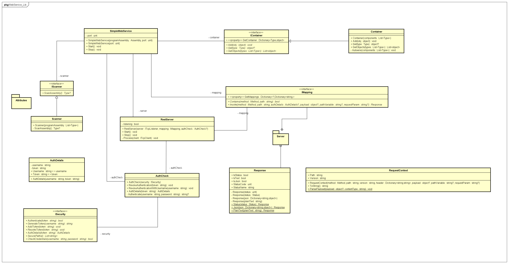

# WebService

## 🛠 Build 

```
dotnet build --configuration Release
```

## 🚴‍♂️Run

Run CRUD message listener example code

```
dotnet run --project ./WebService/WebService.csproj
```

## 🧪 Test

Run unit tests

```
dotnet test
```

For the integration the application [Postman](https://www.postman.com/) is needed.

The test collection for Postman can be found under `WebService-Test/Integration/postman`.


## `WebService_Lib` Design




